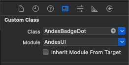
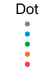

# AndesBadgeDot

 AndesBadgeDot is a small unit of information that allow you to indicate the status of an item or differentiate several similar items from each other.  
 [See Andes UI component in frontify](https://company-161429.frontify.com/d/kxHCRixezmfK/n-a#/components/badge/dot)

 ```swift
 @objc public class AndesBadgeDot: UIView 
 ```
 ## Interface Builder 
 | Class |
 | -------- |
 | |

 <br/>

 ## Constructors

**By frame:** <br/>
AndesBadgeDot(frame: [CGRect](https://developer.apple.com/documentation/coregraphics/cgrect)) <br/>

**By properties:** <br/>
AndesBadgeDot(type: [AndesBadgeType](#andesbadgetype)) 

 <br/>

 | Parameter | Description |
 | -------- | ------- |
 | type | **[AndesBadgeType](#andesbadgetype)**: Set a color palette for the badge. Default type is **.neutral** |

 <br/>

 ## Properties
 | Property | Summary |
 | -------- | ------- |
 | type: [AndesBadgeType](#andesbadgetype) | Set a color palette for the badge **public get** and **set** |

 <br/>

 ## Related Classes

 ### AndesBadgeType
 Defines the possible styles [AndesBadgeDot](#AndesBadgeDot) can take.
 ```swift
 @objc public enum AndesBadgeType: Int, AndesEnumStringConvertible {
    case neutral
    case highlight
    case success
    case warning
    case error
}
 ```
 | Enum Values | Description |
 | --------- | ------------- |
 | neutral | Gives a gray color style to the component <br/>  |
 | highlight | Gives a blue color style to the component <br/>  |
 | success | Gives a green color style to the component <br/>  |
 | warning | Gives an orange color style to the component <br/>  |
 | error | Gives a red color style to the component <br/>  |

 <br/>

 #### Functions
 | Return type | Method |
 | -------- | ------- |
 | String | **public static keyFor(_ value: AndesBadgeType)**<br/> Retrieves a string from the AndesBadgeType case |

 <br/>


 

 ## Screenshots
  