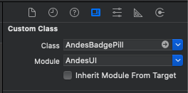
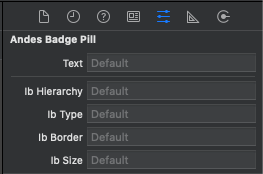
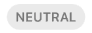
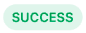
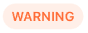
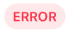
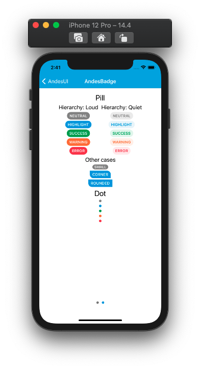

# AndesBadgePill

 AndesBadgePill is a small unit of information that allow you to indicate the status of an item or differentiate several similar items from each other.  
 [See Andes UI component in frontify](https://company-161429.frontify.com/d/kxHCRixezmfK/n-a#/components/badge/pill)

 ```swift
 @objc public class AndesBadgePill: UIView
 ```
 ## Interface Builder 
 | Class | IB Attriburtes |
 | -------- | ------- |
 | ||

 <br/>

 ## Interface Builder Attributes
 | Property | Summary |
 | -------- | ------- |
  | Text | Text to display insde the pill.|
 | ib Hierachy | Determines hierarchy style: **loud**, **quiet** |
 | ib Type | Set a color palette for the badge: **neutral**, **highlight**, **success**, **warning**, **error** |
 | ib Size | Badge display size: **large**, **small** |
 | ib Border | Badge border style: **corner**, **rounded**, **standard** |


 <br/>

 ## Constructors

**By frame:** <br/>
AndesBadgePill(frame: [CGRect](https://developer.apple.com/documentation/coregraphics/cgrect)) <br/>

**By properties:** <br/>
AndesBadgePill(hierarchy: [AndesBadgeHierarchy](#andesbadgehierarchy),</br>&emsp;&emsp;&emsp;&emsp;&emsp;&emsp;&emsp;&emsp; type: [AndesBadgeType](#andesbadgetype),</br>&emsp;&emsp;&emsp;&emsp;&emsp;&emsp;&emsp;&emsp; border: [AndesBadgeBorder](#andesbadgeborder), </br>&emsp;&emsp;&emsp;&emsp;&emsp;&emsp;&emsp;&emsp; size: [AndesBadgeSize](#andesbadgesize),</br>&emsp;&emsp;&emsp;&emsp;&emsp;&emsp;&emsp;&emsp; text: [String](https://developer.apple.com/documentation/swift/string)) 


 <br/>

 | Parameter | Description |
 | -------- | ------- |
 | hierarchy | **[AndesBadgeHierarchy](#andesbadgehierarchy)**: Determines hierarchy style. Default hierarchy is **.loud** |
 | type | **[AndesBadgeType](#andesbadgetype)**: Set a color palette for the badge. Default type is **.neutral** |
 | border | **[AndesBadgeBorder](#andesbadgeborder)**: Badge border style. Default border is **.standard** |
 | size | **[AndesBadgeSize](#andesbadgesize)**: Badge display size. Default size is **.large** |
 | text | **[String](https://developer.apple.com/documentation/swift/string)**: Text to display. Default string is an empty string. |

 <br/>

 ## Properties
 | Property | Summary |
 | -------- | ------- |
 | hierarchy: [AndesBadgePillHierarchy](#andesbadgehierarchy) | Determines hierarchy style. **public get** and **set** |
 | type: [AndesBadgeType](#andesbadgetype) | Set a color palette for the badge **public get** and **set** |
 | border: [AndesBadgeBorder](#andesbadgeborder) | Badge border style. **public get** and **set** |
 | size: [AndesBadgeSize](#andesbadgesize) | Badge display size. **public get** and **set** |
 | text: String | Text to display. **public get** and **set** |

 <br/>

 ## Related Classes

### AndesBadgeHierarchy
Defines the style of an Andes Badge </br>
```swift
@objc public enum AndesBadgeHierarchy: Int, AndesEnumStringConvertible {
    case loud
    case quiet
}
```

 | Enum Values | Description |
 | ----------- | ----------- |
 | loud | Make badge's color noticible <br/> |
 | quiet | Make the badge's color light <br/> |

 <br/>

 #### Functions
 | Return type | Method |
 | -------- | ------- |
 | String | **public static keyFor(_ value: AndesBadgeHierarchy)**<br/> Retrieves a string from the AndesBadgeHierarchy case |

 <br/>

 ### AndesBadgeType
 Defines the possible styles [AndesBadgePill](#andesbadgepill) can take.
 ```swift
 @objc public enum AndesBadgeType: Int, AndesEnumStringConvertible {
    case neutral
    case highlight
    case success
    case warning
    case error
}
 ```
 | Enum Values | Description |
 | --------- | ------------- |
 | neutral | Gives a gray color style to the component <br/>  |
 | highlight | Gives a blue color style to the component <br/>  |
 | success | Gives a green color style to the component <br/>  |
 | warning | Gives an orange color style to the component <br/>  |
 | error | Gives a red color style to the component <br/>  |

 <br/>

 #### Functions
 | Return type | Method |
 | -------- | ------- |
 | String | **public static keyFor(_ value: AndesBadgeType)**<br/> Retrieves a string from the AndesBadgeType case |

 <br/>


 
 ### AndesBadgeBorder
 Defines the possible border styles [AndesBadgePill](#andesbadge) can take.
 ```swift
 @objc public enum AndesBadgeBorder: Int, AndesEnumStringConvertible {
    case standard
    case corner
    case rounded
}
 ```
 <br/>

 | Enum Values | Description |
 | ----------- | ----------- |
 | standard | All badge corners are rounded <br/> |
 | corner | Top-left and bottom-right corners are square, top-right and bottom-left corners are rounded <br/> |
 | rounded | Only bottom-left corner is rounded <br/> |

 
<br/>

 #### Functions
 | Return type | Method |
 | -------- | ------- |
 | String | **public static keyFor(_ value: AndesBadgeBorder)**<br/> Retrieves a string from the AndesBadgeBorder case |
 <br/>

 ### AndesBadgeSize
 Defines the possible sizes [AndesBadgePill](#andesbadgepill) can take.
 ```swift
 @objc public enum AndesBadgeSize: Int, AndesEnumStringConvertible {
    case small
    case large
}
 ```
 | Enum Values | Description |
 | ----------- | ----------- |
 | small | Small badge size <br/> |
 | large | Large badge size <br/> |

 <br/>

 #### Functions
 | Return type | Method |
 | -------- | ------- |
 | String | **public static keyFor(_ value: AndesBadgeSize)**<br/> Retrieves a string from the AndesBadgeSize case |

 <br/>

 ## Screenshots
  