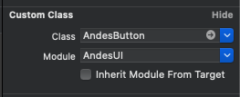
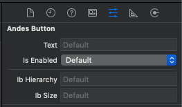
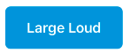
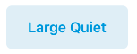
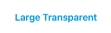
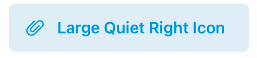
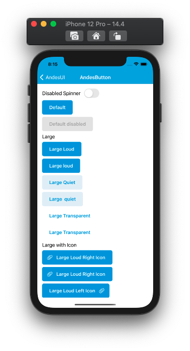
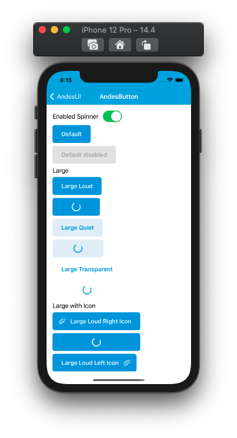
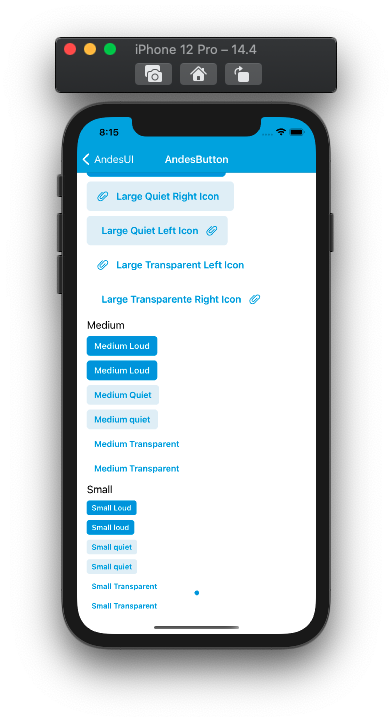
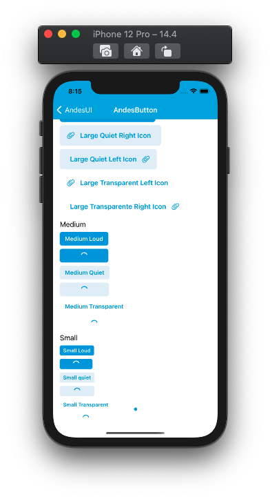

# AndesButton

User interface component which allows the user interact by tapping it to perform an action.
[See Andes UI component in frontify](https://company-161429.frontify.com/d/kxHCRixezmfK/n-a#/components/button-1584453489)

 ```swift
 @objc public class AndesButton: UIControl
 ```
 ## Interface Builder 
 | Class | IB Attriburtes |
 | -------- | ------- |
 | ||

 <br/>

 ## Interface Builder Attributes
 | Property | Summary |
 | -------- | ------- |
 | Text | Text to display inside the button.|
 | isEnabled | Defines the status of the button wether is enabled or disabled: **ON**, **OFF**.|
 | ib Hierarchy | Determines hierarchy style: **LOUD**, **QUIET**, **TRANSPARENT**.|
 | ib Size | Defines different sizes that a button supports: **LARGE**, **MEDIUM**, **SMALL**.|


 <br/>

 ## Constructors

**By properties:** <br/>
AndesButton(text: [String](https://developer.apple.com/documentation/swift/string),
</br>&emsp;&emsp;&emsp;&emsp;&emsp;&emsp;&emsp;hierarchy: [AndesButtonHierarchy](#AndesButtonHierarchy),
</br>&emsp;&emsp;&emsp;&emsp;&emsp;&emsp;&emsp;size: [AndesButtonSize](#AndesButtonSize),
</br>&emsp;&emsp;&emsp;&emsp;&emsp;&emsp;&emsp;icon: [AndesButtonIcon?](#AndesButtonIcon))

 <br/>

 | Parameter | Description |
 | -------- | ------- |
 | text | Text to display inside the button|
 | hierarchy | **[AndesButtonHierarchy](#AndesButtonHierarchy)** Determines hierarchy style for the button.|
 | size | **[AndesButtonSize](#AndesButtonSize)**: Defines different sizes that a button can take.|
 | icon | **[AndesButtonIcon](#AndesButtonIcon)**: Defines the icon and the position (left or right) of itself inside the button. |

 <br/>

> **NOTE:**<br/>
**[AndesButtonIcon](#AndesButtonIcon)** only shows the icon when the size of the button is **.large**.
---

 ## Properties
 | Property | Description |
 | -------- | ------- |
 | text: [String](https://developer.apple.com/documentation/swift/string)| Text to display inside the button **public**|
 | hierarchy: **[AndesButtonHierarchy](#AndesButtonHierarchy)**  | Determines hierarchy style for the button. **public get** and **set** |
 | size: **[AndesButtonSize](#AndesButtonSize)**: |  Defines different sizes that a button can take. **public get** and **set** |
 | icon: **[AndesButtonIcon](#AndesButtonIcon)**: |  Defines the icon and the position (left or right) of itself inside the button **private set** and **public get**|
 | isEnabled: **Bool** | Defines the  state of the button wether if is enabled or disabled **public get** and **set** |

 <br/>

  ## Functions
 | Return type | Method |
 | -------- | ------- |
 | Void | **@objc public func startSpinner()**<br/> this function replaces the content inside the button with a spinner centered.|
 | Void | **@objc public func stopSpinner()**<br/> this function stops the spinner and left the button as it was configured before startSpinner was called.|
 | Void | **@objc public func setLargeSizeWithIcon(_ icon: AndesButtonIcon)** this function sets the button with a large size and displays the icon as it is configured with the icon parameter.|

 <br/>

 ## Related Classes

### AndesButtonHierarchy
AndesButtonHierarchy contains the differents styles that a button can take</br>
```swift
@objc public enum AndesButtonHierarchy: Int, AndesEnumStringConvertible {
    case loud
    case quiet
    case transparent
}
```

 | Enum Values | Description |
 | ----------- | ----------- |
 | loud | Defines the button with a blue background and white text <br/> |
 | quiet | Defines the button with a light blue background and blue text <br/> |
 | transparent | Defines the button with a white background and blue text <br/> |

 <br/>

 #### Functions
 | Return type | Method |
 | -------- | ------- |
 | String | **public static keyFor(_ value: AndesButtonHierarchy)**<br/> Retrieves a string from the AndesButtonHierarchy case |

 <br/>

### AndesButtonSize
AndesButtonSize contains the differents sizes that a button can take</br>
```swift
@objc public enum AndesButtonSize: Int, AndesEnumStringConvertible {
    case large
    case medium
    case small
}
```

 | Enum Values | Description |
 | ----------- | ----------- |
 | large | Defines the button with a large size <br/> |
 | medium | Defines the button with a medium size <br/> |
 | small | Defines the button with a small size <br/> |

 <br/>

 #### Functions
 | Return type | Method |
 | -------- | ------- |
 | String | **public static keyFor(_ value: AndesButtonSize)**<br/> Retrieves a string from the AndesButtonSize case |

 <br/>
 

### AndesButtonIcon
AndesButtonIcon is an object representation of the icon that will appear inside the [AndesButton](#AndesButton)</br>
```swift
@objc public class AndesButtonIcon: NSObject
```

> **NOTE:**<br/>
**[AndesButtonIcon](#AndesButtonIcon)** only shows the icon when AndesButtonSize of the [AndesButton](#AndesButton) is **.large**.
---

#### Constructor
AndesButtonIcon(icon: [UIImage](https://developer.apple.com/documentation/uikit/uiimage), 
</br>&emsp;&emsp;&emsp;&emsp;&emsp;&emsp;&emsp;&emsp;&emsp;orientation: [AndesButtonOrientation](#AndesButtonOrientation))

 <br/>

 | Parameter | Description |
 | -------- | ------- |
 | icon | Image to show as icon in the button|
 | orientation | **[AndesButtonHierarchy](#AndesButtonHierarchy))** Determines the side of the icon inside the button.|

 <br/>

 #### Properties
 | Parameter | Description |
 | -------- | ------- |
 | icon | Image to show as icon in the button. **private set** and **public get**|
 | orientation | **[AndesButtonHierarchy](#AndesButtonHierarchy))** Determines the side of the icon inside the button. **private set** and **public get**|

 ### AndesButtonOrientation
 Defines the side where the icon inside a large **[AndesButton](#AndesButton))** will take.
```swift
@objc public enum AndesButtonOrientation: Int, AndesEnumStringConvertible {
    case left
    case right
}
```
 | Enum Values | Description |
 | ----------- | ----------- |
 | left | Defines the left position for an icon inside of **[AndesButton](#AndesButton)**. <br/> |
 | right | Defines the right position for an icon inside of **[AndesButton](#AndesButton)**. <br/> |

 ## Screenshots

 
 
 
 
 
