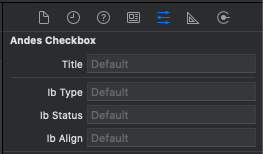
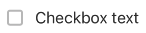
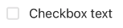
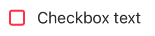
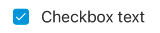
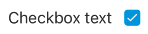
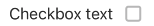
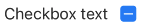
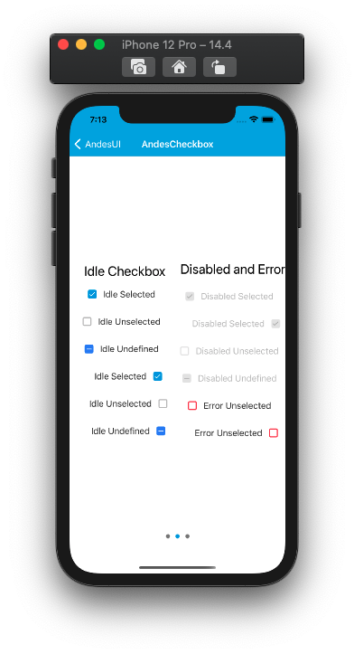
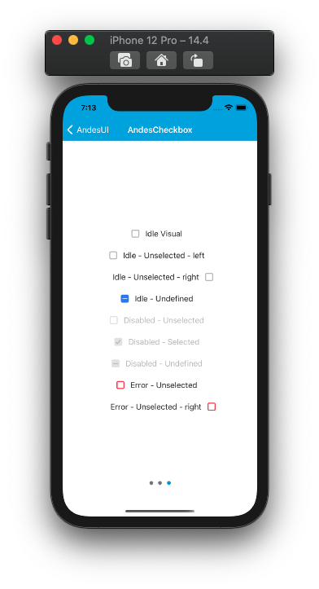

# AndesCheckbox

AndesCheckbox allow you to make multiple selections from a list of options, unlike radio buttons that only allow you to choose a single option. 
 [See Andes UI component in frontify](https://company-161429.frontify.com/d/kxHCRixezmfK/n-a#/components/checkbox)

 ```swift
 @objc public class AndesCheckbox: UIView
 ```
 ## Interface Builder 
 | Class | IB Attriburtes |
 | -------- | ------- |
 | ||

 <br/>

 ## Interface Builder Attributes
 | Property | Summary |
 | -------- | ------- |
 | title | Text to display with the checkbox.|
 | ib Type | Determines the type style for the checkbox: **idle**, **disabled**, **error**|
 | ib Status | Sets the status of the checkbox: **selected**, **unselected**, **undefined** |
 | ib Align |  Sets the checkbox side at the left or right of the text: **left**, **right** |


 <br/>

 ## Constructors

**By frame:** <br/>
AndesCheckbox(frame: [CGRect](https://developer.apple.com/documentation/coregraphics/cgrect)) <br/>

**By properties:** <br/>
AndesCheckbox(type: [AndesCheckboxType](#AndesCheckboxType),</br>&emsp;&emsp;&emsp;&emsp;&emsp;&emsp;&emsp;&emsp;align:[AndesCheckboxAlign](#AndesCheckboxAlign),</br>&emsp;&emsp;&emsp;&emsp;&emsp;&emsp;&emsp;&emsp;status: [AndesCheckboxStatus](#AndesCheckboxStatus), </br>&emsp;&emsp;&emsp;&emsp;&emsp;&emsp;&emsp;&emsp;title: [String](https://developer.apple.com/documentation/swift/string))

 <br/>

 | Parameter | Description |
 | -------- | ------- |
 | type | **[AndesCheckboxType](#AndesCheckboxType)**: Sets the checkbox type style. Default type is **.idle** |
 | align | **[AndesCheckboxAlign](#AndesCheckboxAlign))**: Sets the checkbox side arround the title/text. Default is **.left** |
 | status | **[AndesCheckboxStatus](#AndesCheckboxStatus)**:  Sets checkbox initial status. Default status is **.unselected** |
 | title | **[String](https://developer.apple.com/documentation/swift/string)**: text to display beside the checkbox. Default title is an empty string |

 <br/>

 ## Properties
 | Property | Description |
 | -------- | ------- |
 | type: **[AndesCheckboxType](#AndesCheckboxType)**| Sets the checkbox type style. Default type is **.idle** **public get** and **set** |
 | align: **[AndesCheckboxAlign](#AndesCheckboxAlign))**| Sets the checkbox side arround the title/text. Default is **.left** **public get** and **set** |
 | status: **[AndesCheckboxStatus](#AndesCheckboxStatus)**| Sets checkbox initial status. Default status is **.unselected** **public get** and **set** |
 | title: **[String](https://developer.apple.com/documentation/swift/string)**| text to display beside the checkbox. Default title is an empty string **public get** and **set** |

 <br/>

  ## Functions
 | Return type | Method |
 | -------- | ------- |
 | Void | **@objc public func setCheckboxDidTapped(callback: @escaping ((AndesCheckbox) -> Void))**<br/> this function sets the handler to listen to taps on the checkbox through sending the checkbox with the new status |

 ## Related Classes

### AndesCheckboxType
Defines the possible type styles that the [AndesCheckbox](#AndesCheckbox) can take. </br>
```swift
@objc public enum AndesCheckboxType: Int, AndesEnumStringConvertible {
    case idle
    case disabled
    case error
}
```

 | Enum Values | Description |
 | ----------- | ----------- |
 | idle | Makes the checkbox enable with a gray border <br/> |
 | disabled | Makes the checkbox disable with a light gray border <br/> |
 | error | Makes the checkbox enable with a red border <br/> |

 <br/>

 #### Functions
 | Return type | Method |
 | -------- | ------- |
 | String | **public static keyFor(_ value: AndesCheckboxType)**<br/> Retrieves a string from the AndesCheckboxType case |

 <br/>

 ### AndesCheckboxAlign
 Defines the side of the [AndesCheckbox](#AndesCheckbox) arround the text.
 ```swift
@objc public enum AndesCheckboxAlign: Int, AndesEnumStringConvertible {
    case left
    case right
}
 ```
 | Enum Values | Description |
 | --------- | ------------- |
 | left | Defines the checkbox in the left side of the text <br/>  |
 | right | Defines the checkbox in the right side of the text <br/>  |

 <br/>

 #### Functions
 | Return type | Method |
 | -------- | ------- |
 | String | **public static keyFor(_ value: AndesCheckboxAlign)**<br/> Retrieves a string from the AndesCheckboxAlign case |

 <br/>


 
 ### AndesCheckboxStatus
 Defines the status of an [AndesCheckbox](#AndesCheckbox) wether if the checkbox is selected, unselected or undefined.
 ```swift
@objc public enum AndesCheckboxStatus: Int, AndesEnumStringConvertible {
    case selected
    case unselected
    case undefined
}
 ```
 <br/>

 | Enum Values | Description |
 | ----------- | ----------- |
 | selected | The checkbox will appear with a check inner the box <br/> |
 | unselected | The checkbox will appear with a empty checkbox <br/> |
 | undefined | The checkbox will appear with a dash inner the text box  <br/> |

 
<br/>

 #### Functions
 | Return type | Method |
 | -------- | ------- |
 | String | **public static keyFor(_ value: AndesCheckboxStatus)**<br/> Retrieves a string from the AndesCheckboxStatus case |
 <br/>

 ## Screenshots
    