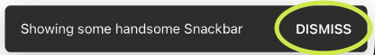
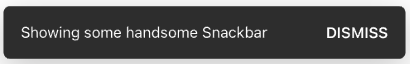
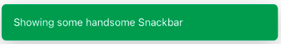
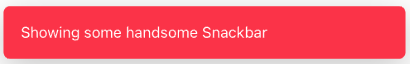
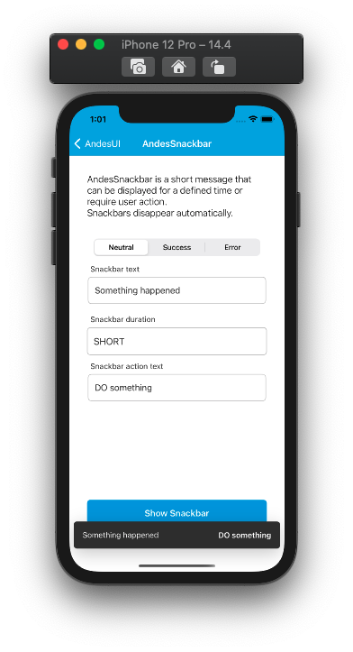
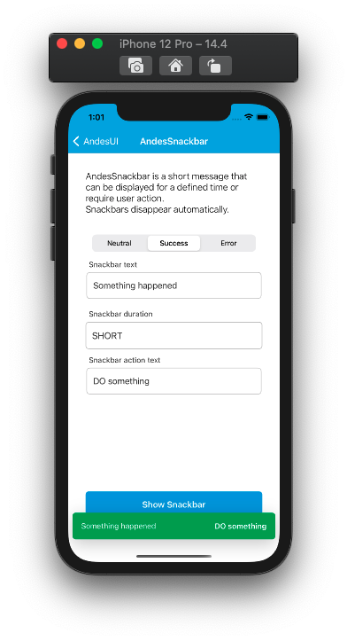
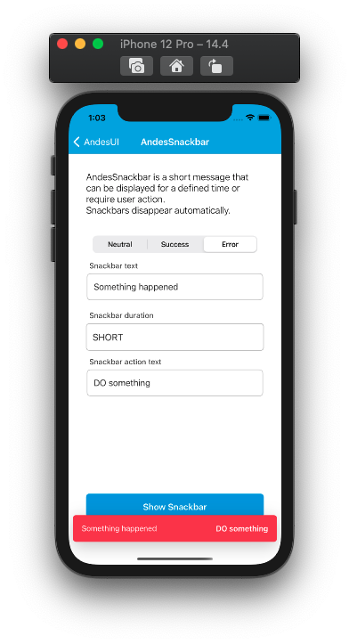

# AndesSnackbar

 AndesSnackbar is a short message that can be displayed for a defined time or require user action. Snackbars disappear automatically. AndesSnackbar communicate the status of an event quickly and concisely. [See Andes UI component in frontify](https://company-161429.frontify.com/d/kxHCRixezmfK/n-a#/components/snackbar) 

 ```swift
 @objc public class AndesSnackbar: UIView
 ```
> **NOTE:**<br/>
This component can't be added through Interface Builder.

 ## Constructors

**By frame:** <br/>
AndesSnackbar(frame: [CGRect](https://developer.apple.com/documentation/coregraphics/cgrect)) <br/>

**By properties:** <br/>
AndesSnackbar(text: [String](https://developer.apple.com/documentation/swift/string), 
</br>&emsp;&emsp;&emsp;&emsp;&emsp;&emsp;&emsp;&emsp;duration: [AndesSnackbarDuration](#andessnackbarduration), 
</br>&emsp;&emsp;&emsp;&emsp;&emsp;&emsp;&emsp;&emsp;type: [AndesSnackbarType](#andessnackbartype))

 <br/>

 | Parameter | Description |
 | -------- | ------- |
 | text | **[String](https://developer.apple.com/documentation/swift/string)**: Text to display. Default string is an empty string. |
 | duration | **[AndesSnackbarDuration](#AndesSnackbarDuration)**: Determines how long will the Snackbar appear in the screen |
 | type | **[AndesSnackbarType](#AndesSnackbarType)**: Defines the background color and style of the snackbar, Default type is **.neutral**|

 <br/>

 ## Properties
 | Property | Summary |
 | -------- | ------- |
 | text: **[String](https://developer.apple.com/documentation/swift/string)**| Text to display in the Snackbar. Default text is an empty string. |
 | duration: **[AndesSnackbarDuration](#AndesSnackbarDuration)**| Determines how long will the Snackbar appear in the screen from an enum. Default duration is **normal** (6 seconds)|
 | type: **[AndesSnackbarType](#AndesSnackbarType)**| Defines the background color of the Snackbar from an enum. Default type is **neutral**  |
 | action: **[AndesSnackbarAction](#AndesSnackbarAction)**| Optional Object that handle the action and the text action for the Snackbar. Default action is`nil` |

 <br/>

 ## Functions
 | Return type | Method |
 | -------- | ------- |
 | Void | **@objc public func show())**<br/> this function finds the top most view controller in the app Window and show the Snackbar in the bottom of that view controller. |
 | Void | **@objc public func show(at viewController: UIViewController)**<br/> this function shows the Snackbar at the viewcontroller sent by the parameter |

> **NOTE:**<br/>
If you are showing the Snackbar as a result of an async method, the best practice is to use show(at viewController:) method, which guarantee that the Snackbar is going to be shown only in that view controller if it's visible.
---


## Adding an action
 <br/>
To show the **AndesSnackbar** with an action you have to assign the property **action** by creating a **AndesSnackbarAction** object e.g: 
```swift
snackbar.action = AndesSnackbarAction(text: "DISMISS") {
    // write your code in here executed as a consequence of tapping Snackbar action 
}
```

## Related Classes

### AndesSnackbarDuration
Defines the duration time showed in the screen of an [AndesSnackbar](#AndesSnackbar). </br>
```swift
@objc public enum AndesSnackbarDuration: Int, AndesEnumStringConvertible {
    case short = 3
    case normal = 6
    case long = 10
}
```

 | Enum Values | Description |
 | ----------- | ----------- |
 | short | Designed for short text length, this shows Snackbar for 3 seconds |
 | normal | Designed for medium text length, this shows Snackbar for 6 seconds |
 | long | Designed for long text length, this shows Snackbar for 10 seconds 

 <br/>

 #### Functions
 | Return type | Method |
 | -------- | ------- |
 | String | **public static keyFor(_ value: AndesSnackbarDuration)**<br/> Retrieves a string from the AndesSnackbarDuration case |

 <br/>

 ### AndesSnackbarType
 Defines the possible styles [AndesSnackbar](#AndesSnackbar) can take.
 ```swift
 @objc public enum AndesSnackbarType: Int, AndesEnumStringConvertible {
    case neutral
    case success
    case error
 }
 ```
 | Enum Values | Description |
 | --------- | ------------- |
 | neutral | Gives a gray color style to the component <br/>  |
 | success | Gives a green color style to the component <br/>  |
 | error | Gives a red color style to the component <br/>  |

 <br/>

 #### Functions
 | Return type | Method |
 | -------- | ------- |
 | String | **public static keyFor(_ value: AndesSnackbarType)**<br/> Retrieves a string from the AndesSnackbarType case |
 | UIColor | **public func toColor() -> UIColor**<br/> Retrieves a color from the curent AndesSnackbarType case |

 <br/>

 ### AndesSnackbarAction
Object that adds an action on the right side of the Snackbar with the text added through the constructor.
```swift
@objc public class AndesSnackbarAction: NSObject
```

 **Constructor:**
```swift
@objc public init(text: String, callback: (() -> Void)? = nil)
```

 | Parameter | Description |
 | -------- | ------- |
 | text | **[String](https://developer.apple.com/documentation/swift/string)**: Text to display in the action. Default string is an empty string. |
 | callback | **(() -> Void)**: optional closure which handles the action over the text showed in the Snackbar. Default closure is `nil`|

 ## Screenshots
    