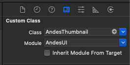
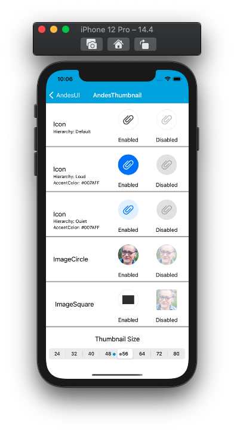
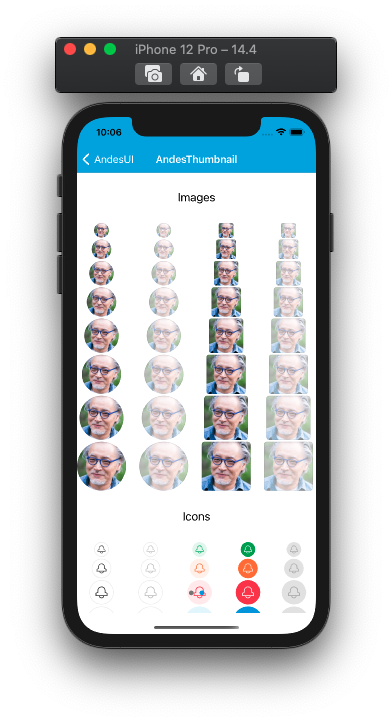
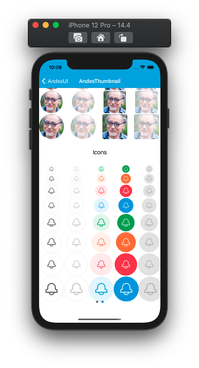

# AndesThumbnail

AndesThumbnail is a container that display an image, logo or icon to complement content and reinforce meaning.
 [See Andes UI component in frontify](https://company-161429.frontify.com/d/kxHCRixezmfK/n-a#/components/thumbnail-1589997379)

  ```swift
 @objc public class AndesThumbnail: UIView
 ```
 ## Interface Builder 
 | Class | IB Attriburtes |
 | -------- | ------- |
 | ||

 <br/>

 ## Interface Builder Attributes
 | Property | Summary |
 | -------- | ------- |
 | Image | Defines the name of the image or icon from the app's assets to be shown.|
 | Accent Color | this only applies the main color to a thumbnail icon type |
 | Ib Type | thumbnail design type, specifies if it's an image, a circle image or an icon: **ICON**, **IMAGE_CIRCLE**, **IMAGE_SQUARE** |
 | Ib Size |  Sets the frame size of the thumbnail: **size_24**, **size_32**, **size_40**, **size_48**, **size_56**, **size_64**, **size_72**, **size_80** |
 | Ib Hierarchy |  Sets the hierarchy style, this only applies to a thumbnail icon type: **DEFAULT**, **QUIET**, **LOUD** |
 | Ib State |  Sets the state of the thumbnail: **ENABLED**, **DISABLED** |

 <br/>


 ## Constructors

**By frame:** 
<br/>
AndesThumbnail(frame: [CGRect](https://developer.apple.com/documentation/coregraphics/cgrect)) 
<br/>

**By properties:** 
<br/>
AndesThumbnail(hierarchy: [AndesThumbnailHierarchy](#AndesThumbnailHierarchy),
</br>&emsp;&emsp;&emsp;&emsp;&emsp;&emsp;&emsp;&emsp;&emsp;type: [AndesThumbnailType](#AndesThumbnailType),
</br>&emsp;&emsp;&emsp;&emsp;&emsp;&emsp;&emsp;&emsp;&emsp;size: [AndesThumbnailSize](#AndesThumbnailSize),
</br>&emsp;&emsp;&emsp;&emsp;&emsp;&emsp;&emsp;&emsp;&emsp;state: [AndesThumbnailState](#AndesThumbnailState),
</br>&emsp;&emsp;&emsp;&emsp;&emsp;&emsp;&emsp;&emsp;&emsp;image: [UIImage](https://developer.apple.com/documentation/uikit/uiimage),
</br>&emsp;&emsp;&emsp;&emsp;&emsp;&emsp;&emsp;&emsp;&emsp;accentColor: [UIColor?](https://developer.apple.com/documentation/uikit/uicolor))
<br/>

 | Parameter | Description |
 | -------- | ------- |
 | hierarchy | **[AndesThumbnailHierarchy](#AndesThumbnailHierarchy)**: Enum that sets the hierarchy style, this only applies to a thumbnail icon type. Default is **.defaultHierarchy**|
 | type | **[AndesThumbnailType](#AndesThumbnailType)**: Enum for thumbnail design type, specifies if it's an image, a circle image or an icon. Default is **.icon**|
 | size | **[AndesThumbnailSize](#AndesThumbnailSize))**: Enum that sets the frame size of the thumbnail. Default is **.size24**|
 | state | **[AndesThumbnailState](#AndesThumbnailState)**:  Enum that sets the state of the thumbnail **.enabled** |
 | image | **[UIImage](https://developer.apple.com/documentation/uikit/uiimage)**: Defines the image or icon to be shown. it does not have a default value. |
 | accentColor | **[UIColor](https://developer.apple.com/documentation/uikit/uicolor)**: this only applies the main color to a thumbnail icon type |
<br/>


 ## Properties
 | Property | Description |
 | -------- | ------- |
 | hierarchy**[AndesThumbnailHierarchy](#AndesThumbnailHierarchy)**| Sets the hierarchy style. **public get** and **set** |
 | type**[AndesThumbnailType](#AndesThumbnailType)**| Thumbnail design type. **public get** and **set** 
 | size**[AndesThumbnailSize](#AndesThumbnailSize))**| Sets the frame size of the thumbnail. **public get** and **set** |
 | state**[AndesThumbnailState](#AndesThumbnailState)**| Sets the state of the thumbnail. **public get** and **set** |
 | image: **[UIImage](https://developer.apple.com/documentation/uikit/uiimage)**| Defines the image or icon to be shown. **public get** and **set** . |
 | accentColor: **[UIColor](https://developer.apple.com/documentation/uikit/uicolor)**| Main color to a thumbnail icon type. **public get** and **set**  |

 <br/>

 ## Related Classes


### AndesThumbnailHierarchy
Defines the possible type styles that the [AndesThumbnail](#AndesThumbnail) icon can take. </br>
```swift
@objc public enum AndesThumbnailHierarchy: Int, AndesEnumStringConvertible {
	case defaultHierarchy
	case loud
	case quiet
}
```
> Note: This property only applies to thumbnail icon type

 | Enum Values | Description |
 | ----------- | ----------- |
 | defaultHierarchy | shows the icon with a black color and a gray border <br/> |
 | loud | shows the icon with a white color and sets the accent accent color to the background<br/> |
 | quiet | shows the icon with the accent color and a light accent color as a background <br/> |

 <br/>

 #### Functions
 | Return type | Method |
 | -------- | ------- |
 | String | **public static keyFor(_ value: AndesThumbnailHierarchy)**<br/> Retrieves a string from the AndesThumbnailHierarchy case |

 <br/>

### AndesThumbnailType
The AndesThumbnailType contains the differents types that [AndesThumbnail](#AndesThumbnail) supports. </br>
```swift
@objc public enum AndesThumbnailType: Int, AndesEnumStringConvertible {
	case icon
	case imageCircle
	case imageSquare
}
```

 | Enum Values | Description |
 | ----------- | ----------- |
 | icon | Defines the thumbnail as an icon this type makes possible to apply an accent color and define the hierarchy for an thumbnail icon<br/> |
 | imageCircle | Defines the thumbnail as a circle image <br/> |
 | imageSquare | Defines the thumbnail as an square image with rounded corners <br/> |

 <br/>

 #### Functions
 | Return type | Method |
 | -------- | ------- |
 | String | **public static keyFor(_ value: AndesThumbnailType)**<br/> Retrieves a string from the AndesThumbnailType case |

 <br/>


 ### AndesThumbnailSize
 The [AndesThumbnailSize](#AndesThumbnailSize) contains the differents sizes that a [AndesThumbnail](#AndesThumbnail) supports.
 ```swift
@objc public enum AndesThumbnailSize: Int, AndesEnumStringConvertible {
	case size24
	case size32
	case size40
	case size48
	case size56
	case size64
	case size72
	case size80
}
 ```
 | Enum Values | Description |
 | --------- | ------------- |
 | size24 | Defines the thubmnail frame size to 24 <br/>  |
 | size32 | Defines the thubmnail frame size to 32 <br/>  |
 | size40 | Defines the thubmnail frame size to 40 <br/>  |
 | size48 | Defines the thubmnail frame size to 48 <br/>  |
 | size56 | Defines the thubmnail frame size to 56 <br/>  |
 | size64 | Defines the thubmnail frame size to 64 <br/>  |
 | size72 | Defines the thubmnail frame size to 72 <br/>  |
 | size80 | Defines the thubmnail frame size to 80 <br/>  |

 <br/>

 #### Functions
 | Return type | Method |
 | -------- | ------- |
 | String | **public static keyFor(_ value: AndesThumbnailSize)**<br/> Retrieves a string from the AndesThumbnailSize case |
 | AndesThumbnailSize | **public static func floatToAndesThumbnailSize(value: CGFloat)** creates a enum case from a [CGFloat](https://developer.apple.com/documentation/coregraphics/cgfloat) default value is **.size40** if the value does not match with the listed before.|
 <br/>


 
 ### AndesThumbnailState
 Defines the state of an [AndesThumbnail](#AndesThumbnail) wether if the thumbnail is enabled or disabled.
 ```swift
@objc public enum AndesThumbnailState: Int, AndesEnumStringConvertible {
	case enabled
	case disabled
}
 ```
 <br/>

 | Enum Values | Description |
 | ----------- | ----------- |
 | enabled | shows the thumbnail as enabled <br/>  |
 | disabled | shwos the thumbnail as disabled <br/>  |

 
<br/>

 #### Functions
 | Return type | Method |
 | -------- | ------- |
 | String | **public static keyFor(_ value: AndesThumbnailState)**<br/> Retrieves a string from the AndesThumbnailState case|

 <br/>

 ## Screenshots
    
  